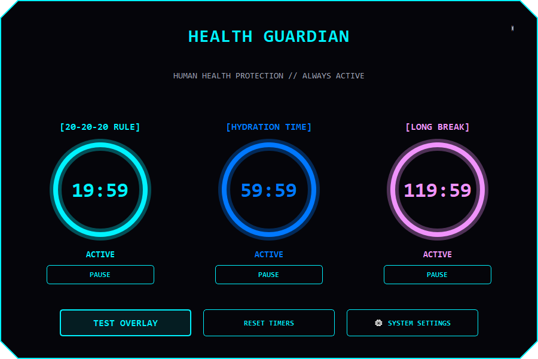
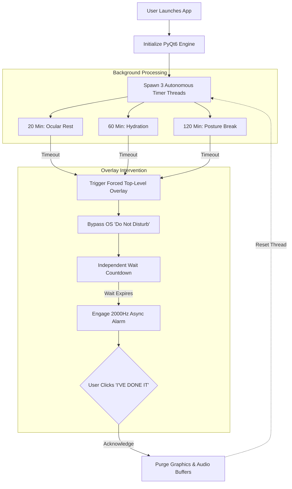
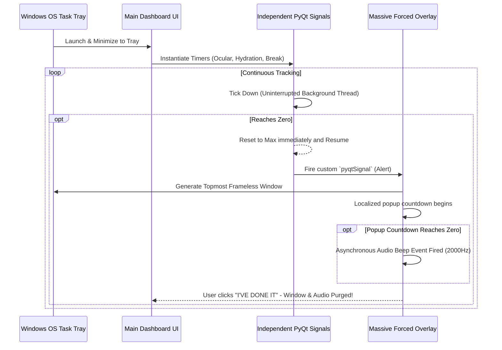

<div align="center">
  <h1>🛡️ Health Guardian</h1>
  
  <p><b>A market-ready, native Windows desktop application meticulously engineered to protect human health and mitigate ocular fatigue during extended PC sessions.</b></p>

  

  <br><br>

  <!-- Tech Stack Badges -->
  <a href="https://www.python.org/"></a>
  <a href="https://riverbankcomputing.com/software/pyqt/intro"></a>
  <a href="https://microsoft.com/windows"></a>
  <a href="https://opensource.org/licenses/MIT"></a>

</div>

<hr>

## 🌟 Overview
Health Guardian utilizes a mathematically drawn Cyber aesthetic, deep autonomous background architectures, and highly strict overlay notifications to ensure critical health protocols are strictly enforced.

By color-coding primary objectives—Ocular Rest (Cyan), Hydration (Blue), and Physical Movement (Magenta)—the dashboard provides clear, glanceable cognitive mapping for your health requirements.

### ✨ Key Features
* **Strict Operating System Overlays**: Takes total control of the display layer (`Qt.WindowStaysOnTopHint`), actively bypassing easily ignored standard Windows Toast Notifications or "Do Not Disturb" focus modes.
* **Localized Async Audio Alerts**: High-frequency recurring audio alerts utilizing asynchronous `winsound` native thread purging.

## ⚕️ The Science of Health Guardian
Prolonged PC usage introduces sustained, unnatural stress to human physiology. Health Guardian mitigates this through three distinct, scientifically-backed protocols:

1. **The 20-20-20 Rule (Ocular Rest)**: Every 20 minutes, the application demands you look at an object 20 feet away for exactly 20 seconds. This action physically relaxes the ciliary muscles inside the eyes, preventing Computer Vision Syndrome (digital eye strain), dryness, and long-term myopia.
2. **Hydration Protocol**: Every 60 minutes, the system enforces a water break. Chronic mild dehydration while focusing on screens leads to headaches, reduced cognitive performance, and noticeable facial fatigue (dark circles and dry skin).
3. **Deep Posture Break**: Every 2 hours, a strict 15-minute complete detachment from the screen is required. This resets the musculoskeletal system, preventing repetitive strain injuries (RSI) and mitigating severe postural degradation.

## 🧠 How It Works
The application abandons traditional notification systems in favor of strict, native disruption logic:
1. **Background Mathematics**: Three independent sub-threads calculate time continuously. They cannot be paused simply by ignoring a notification.
2. **Forced Context Switching**: When a protocol duration expires, PyQt6 physically intercepts the Windows Desktop Manager, spawning an un-ignorable, topmost, frameless overlay across all monitors.
3. **Auditory Conditioning**: Upon the completion of the required rest interval (e.g., 20 seconds of looking away), an asynchronous 2000Hz repeating audio alert engages, ensuring cognitive compliance until the user physically verifies completion by clicking `I'VE DONE IT`.

## 📊 Operational Block Diagram


## ⚙️ Configuration
Access the **⚙ SYSTEM SETTINGS** menu natively within the dashboard to tailor the enforcement:
- `Enable Fullscreen Popups`
- `Play Alert Beeps`
- `Run in Background (Minimize to System Tray)`

## 🚀 Installation & Usage

### Prerequisites
- Python 3.9+
- Windows OS (Tested on Windows 10/11)

### Setup
1. Clone the repository:
   ```bash
   git clone https://github.com/chetan0021/HealthGuardian.git
   cd HealthGuardian
   ```
2. Install dependencies (PyQt6 Native Framework):
   ```bash
   pip install -r requirements.txt
   ```
3. Run the application:
   ```bash
   python main.py
   ```

## 🏗️ Architectural Flow


## 🤝 Collaboration & Contributing
Contributions are what make the open-source community such an amazing place to learn, inspire, and create. Any robust features you contribute to Health Guardian are **greatly appreciated**.

### How to Contribute
1. **Fork the Project**
2. **Create your Feature Branch** (`git checkout -b feature/AmazingFeature`)
3. **Commit your Changes** (`git commit -m 'Add some AmazingFeature'`)
4. **Push to the Branch** (`git push origin feature/AmazingFeature`)
5. **Open a Pull Request**

Please ensure that any new UI additions adhere closely to the established "Cyber" aesthetic blueprint.  

## 📄 License
Distributed under the MIT License. Use it to protect your health globally.
