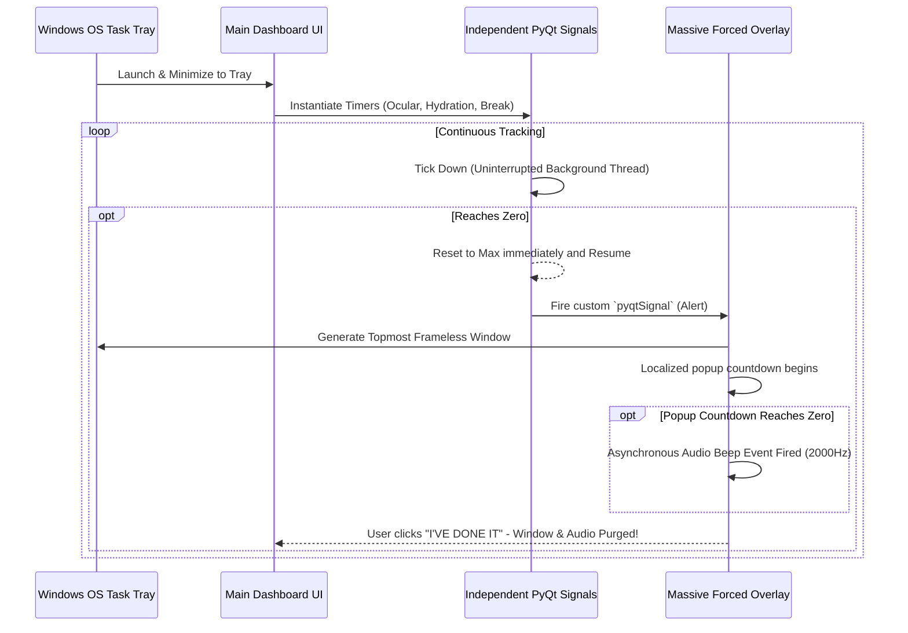

# 🛡️ Health Guardian

> "A market-ready, native Windows desktop application meticulously engineered to protect human health and mitigate ocular fatigue during extended PC sessions."


## 🌟 Overview
Health Guardian utilizes true 7-segment digital fonts, aggressive neon styling, zero-dependency background architectures, and highly strict overlay notifications to ensure critical health protocols are strictly enforced.

By color-coding primary objectives—Ocular Rest (Cyan), Hydration (Blue), and Physical Movement (Magenta)—the dashboard provides clear, glanceable cognitive mapping for your health requirements.

### ✨ Key Features
* **True Digital Aesthetics**: Automatically securely installs the `DSEG-7_Classic` digital font for the Cyber HUD aesthetic.
* **Strict Operating System Overlays**: Takes total control of the display layer (`Qt.WindowStaysOnTopHint`), actively bypassing easily ignored standard Windows Toast Notifications or "Do Not Disturb" focus modes.
* **Independent Background Architecture**: Timers decouple from the UI constraints and operate mathematically in the background, never losing a second of time even when notifications are paused on-screen.
* **Localized Async Audio Alerts**: High-frequency recurring audio alerts utilizing asynchronous `winsound` native thread purging.

## ⚙️ Configuration
Access the **⚙ SYSTEM SETTINGS** menu natively within the dashboard to tailor the enforcement:
- `Enable Fullscreen Popups`
- `Play Alert Beeps`
- `Run in Background (Minimize to System Tray)`

## 🚀 Installation & Usage

### Prerequisites
- Python 3.9+
- Windows OS (Tested on Windows 10/11)

### Setup
1. Clone the repository:
   ```bash
   git clone https://github.com/chetan0021/HealthGuardian.git
   cd HealthGuardian
   ```
2. Install dependencies (PyQt6 Native Framework):
   ```bash
   pip install -r requirements.txt
   ```
3. Run the application:
   ```bash
   python main.py
   ```

## 🏗️ Architectural Flow


## 🤝 Collaboration & Contributing
Contributions are what make the open-source community such an amazing place to learn, inspire, and create. Any robust features you contribute to Health Guardian are **greatly appreciated**.

### How to Contribute
1. **Fork the Project**
2. **Create your Feature Branch** (`git checkout -b feature/AmazingFeature`)
3. **Commit your Changes** (`git commit -m 'Add some AmazingFeature'`)
4. **Push to the Branch** (`git push origin feature/AmazingFeature`)
5. **Open a Pull Request**

Please ensure that any new UI additions adhere closely to the established "Cyber" aesthetic blueprint.  

## 📄 License
Distributed under the MIT License. Use it to protect your health globally.
