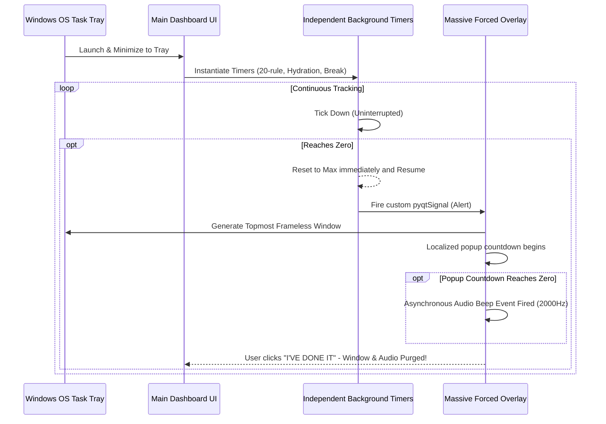

# Health Guardian (Iron Man / Jarvis Edition)

Native Windows desktop application designed to protect human health during long PC sessions. Health Guardian utilizes true 7-segment digital fonts, aggressive neon styling, zero-dependency background architectures, and highly strict overlay notifications to ensure the health protocols (20-20-20 Rule, Hydration, Long Screen Breaks) are followed.

## Core Philosophy & Design
Rather than relying on Windows OS toast notifications—which are easily ignored and frequently blocked by "Do Not Disturb" (Focus Assist) modes—Health Guardian takes total control of the display layer. When a health interval is triggered, the application enforces a native, transparent, top-level system window (`Qt.WindowStaysOnTopHint`) directly in the center of the screen.

This overlay comes with its own independent localized countdown and high-frequency recurring audio alerts (via asynchronous `winsound` native threading) that refuse to stop until verbally acknowledged.

## Architectural Flow

## Setup & Running
1. Clone the repository.
2. Install dependencies: `pip install -r requirements.txt` (Installs PyQt6 Native Bindings).
3. Run the application: `python main.py`

*(Note: On first run, the app will ping github automatically to securely download and install the `DSEG-7_Classic` digital font for the Iron Man/Jarvis aesthetics).*

## Configuration
Access the `⚙ SYSTEM SETTINGS` menu natively within the dashboard to toggle:
- `Enable Fullscreen Popups`
- `Play Alert Beeps`
- `Run in Background (Minimize to System Tray)`
